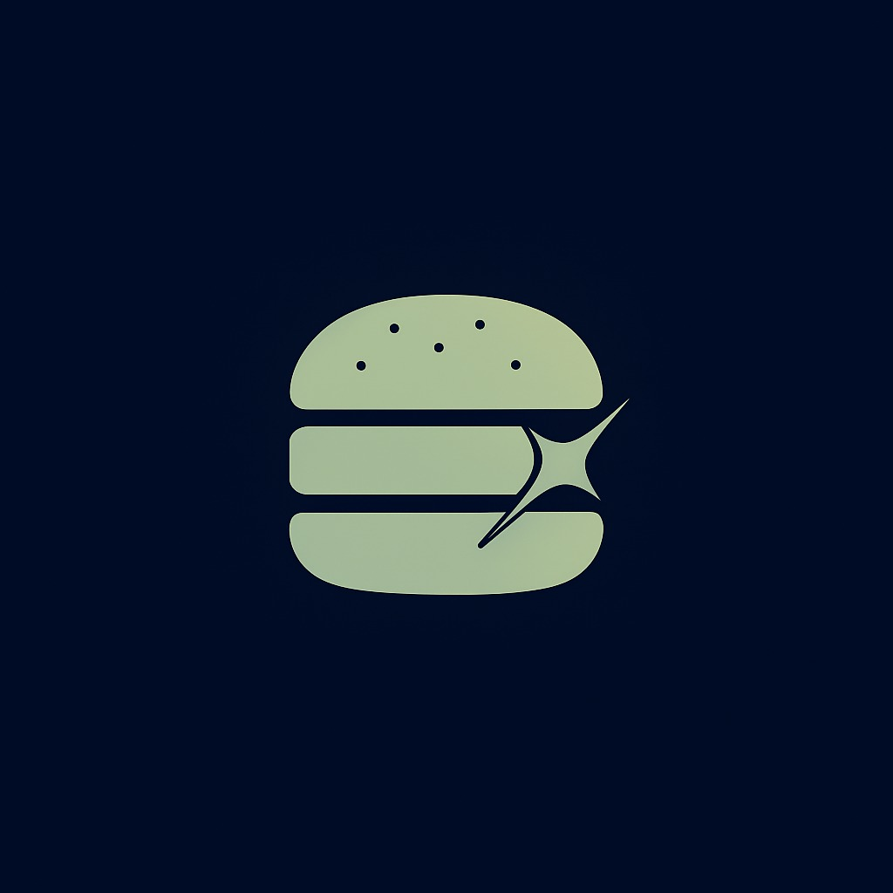

# Café App ☕️

Bem-vindo ao **Café App** – um aplicativo moderno criado com [Expo](https://expo.dev/) e React Native para apaixonados por café. Este projeto foca em proporcionar uma experiência fluida e intuitiva para clientes de cafeterias, com interface elegante e recursos pensados para o dia a dia.

---

## Índice

- [Sobre o Projeto](#sobre-o-projeto)
- [Funcionalidades](#funcionalidades)
- [Screenshots](#screenshots)
- [Como Rodar Localmente](#como-rodar-localmente)
- [Estrutura de Pastas](#estrutura-de-pastas)
- [Tecnologias Utilizadas](#tecnologias-utilizadas)
- [Configuração do Ambiente](#configuração-do-ambiente)
- [Personalização](#personalização)
- [Contribuindo](#contribuindo)
- [Licença](#licença)

---

## Sobre o Projeto

O **Café App** foi desenvolvido para facilitar o pedido de cafés, acompanhar novidades e visualizar produtos de cafeterias. Ele é totalmente responsivo e pronto para ser usado tanto em dispositivos Android quanto iOS.

---

## Funcionalidades

- Listagem de produtos (cafés, bebidas, acompanhamentos)
- Visualização de detalhes do produto
- Tela de splash personalizada
- Interface adaptada para tablets e smartphones
- Suporte ao tema claro (light mode)
- Navegação fluída com [expo-router](https://docs.expo.dev/router/introduction/)
- Carregamento de fontes customizadas

---

## Screenshots

> Adicione aqui screenshots do app para mostrar a interface. Exemplo:

| Tela Inicial | Listagem de Produtos | Detalhe do Produto |
|--------------|---------------------|--------------------|
|  |  |  |

---

## Como Rodar Localmente

1. **Clone o repositório**
    ```bash
    git clone https://github.com/JaoBueno12/FrontEnd-Caf-.git
    cd FrontEnd-Caf-
    ```

2. **Instale as dependências**
    ```bash
    npm install
    # ou
    yarn
    ```

3. **Inicie o projeto**
    ```bash
    npx expo start
    ```

4. **Abra no emulador ou dispositivo físico**
    - Use o app [Expo Go](https://expo.dev/client) para escanear o QR code no terminal.

---

## Estrutura de Pastas

```
assets/
  images/         # Imagens usadas (ícones, splash, etc.)
src/
  app/            # Páginas e rotas principais do app
  components/     # Componentes reutilizáveis
  assets/         # Recursos estáticos adicionais
  ...
app.json          # Configurações do projeto Expo
```

---

## Tecnologias Utilizadas

- [React Native](https://reactnative.dev/)
- [Expo](https://expo.dev/)
- [expo-router](https://docs.expo.dev/router/introduction/)
- [expo-font](https://docs.expo.dev/versions/latest/sdk/font/)
- [JavaScript](https://developer.mozilla.org/pt-BR/docs/Web/JavaScript)
- [Node.js](https://nodejs.org/)

---

## Configuração do Ambiente

- Node.js (recomenda-se versão LTS)
- Expo CLI instalado globalmente:
    ```bash
    npm install -g expo-cli
    ```

---

## Contribuindo

Contribuições são super bem-vindas! Para contribuir:

1. Faça um fork do projeto
2. Crie uma branch para sua feature/correção (`git checkout -b minha-feature`)
3. Commit suas alterações (`git commit -m 'feat: nova feature'`)
4. Push para a branch (`git push origin minha-feature`)
5. Abra um Pull Request

---

## Licença
(https://github.com/JaoBueno12)
(https://github.com/Fabricio687)

---